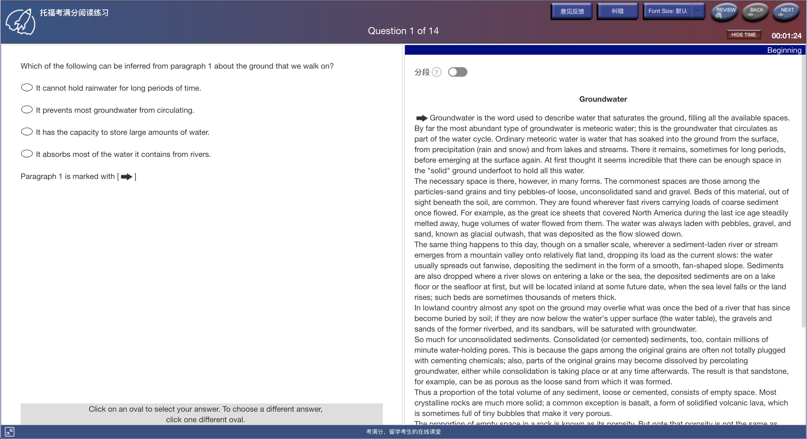
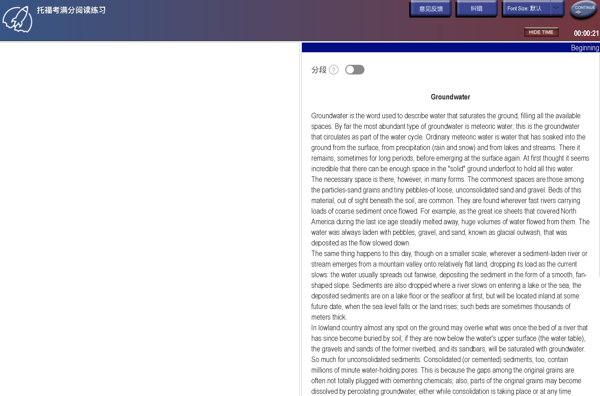
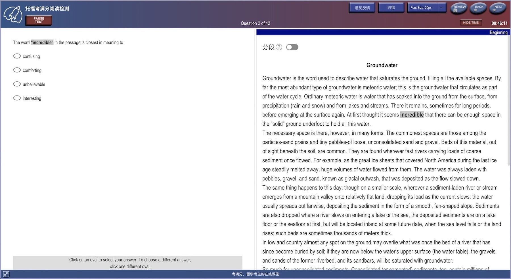
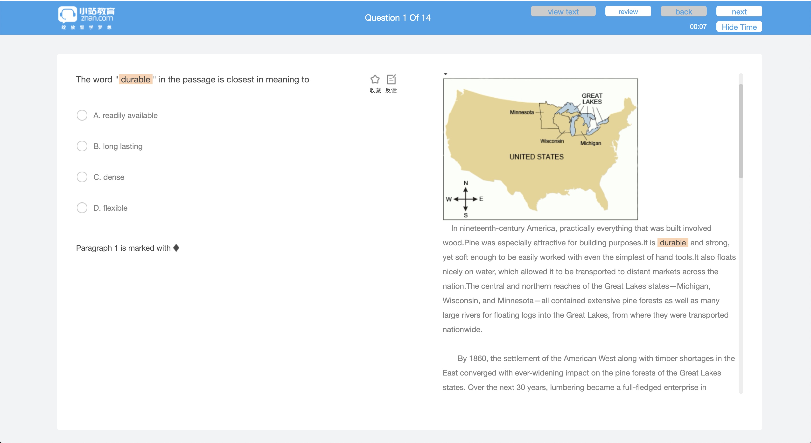
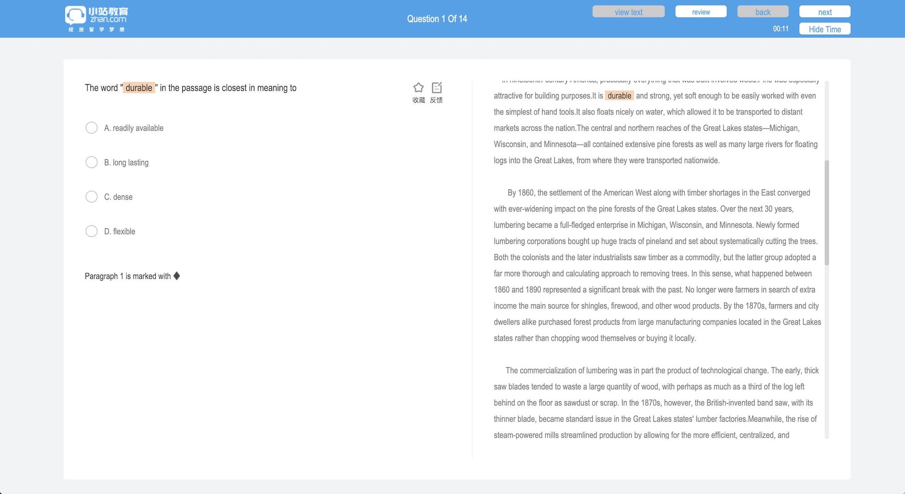

# Toefl-Fontfamily-Change

This is a Tampermonkey Script aiming to imitate the True Toefl Environment on website KMF and Xiaozhan!
You can install this script at [toefl-fontfamily-change on Greasy Fork](https://greasyfork.org/zh-CN/scripts/377254-toefl-fontfamily-change)

# Performance

KMF-before



After




If you'd love to **keep the smooth effect**, please omit the following code. Attention, the true toefl environment have no smooth effect on the screens.

```
body.style.webkitFontSmoothing = 'none';
```

And the following effect is what you will get.




XiaoZhan-Before




XiaoZhan-after




# Installation Guide

Here is a more detailed installation Guide in Chinese. [link](https://www.zuozuovera.com/archives/1597/)

# Declare

This script is still in beta version(but you can begin to use it), I will try my best to optimize it at my free time. I also welcome anyone who wants to finish this script together.

By the way, this Script is under [Mozilla Public License 2.0](https://choosealicense.com/licenses/mpl-2.0/).

If you have any question or suggestion for it, please don't hesitate to let me know.

* My Weibo: @左左薇拉vera
* My Blog : [www.zuozuovera.com](www.zuozuovera.com)


# Author

[VeraZuo](https://github.com/verazuo)

